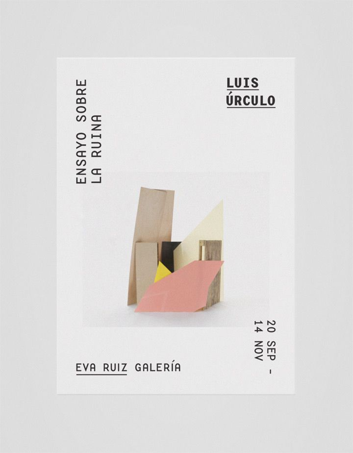

# 📋 Issue #2: Perbaikan UI LiBooks Lanjutan

> **File yang diubah:** `index.html` (semua perubahan ada di satu file ini!)
> **Untuk:** Junior programmer / AI model yang akan mengimplementasikan fitur ini.
> **Catatan penting:** Jangan ubah bagian yang tidak disebutkan, dan jangan hapus data buku yang sudah ada!

---

## 📌 Ringkasan Perubahan

| No | Area | Apa yang diubah |
|----|------|-----------------|
| 1 | Global | Buat modal popup untuk tombol "Detail" di halaman Katalog dan Carousel |
| 2 | Carousel | Hapus sisa kode SVG nyasar, rata tengah judul & konten, gambar random lokal, sinopsis terpotong per device, transisi smooth, margin tombol, rapatkan jarak elemen |
| 3 | Subscribe | Pindahkan judul "Mari Terhubung!" ke luar kotak coklat |
| 4 | Responsive | Cek & fix konten yang keluar di sisi kanan pada mobile |

---

## ✅ TASK 1 — Modal Detail Buku

### Tujuan:
Saat user klik tombol **"Detail"** (di kartu buku Katalog atau slide Carousel), tampilkan sebuah **modal popup** yang berisi info lengkap buku tersebut.

### Langkah-langkah:

**1. Tambahkan HTML modal di bawah `</nav>` atau sebelum `</body>`:**

```html
<!-- Modal Detail Buku -->
<div id="modal-detail" class="fixed inset-0 z-[100] hidden items-center justify-center bg-black/50 backdrop-blur-sm p-4">
  <div class="bg-white rounded-[30px] shadow-2xl max-w-2xl w-full max-h-[90vh] overflow-y-auto p-8 relative animate-fadeIn">
    <!-- Tombol tutup -->
    <button onclick="closeModal()" class="absolute top-4 right-4 text-slate-400 hover:text-primary transition-colors">
      <svg class="w-6 h-6" fill="none" stroke="currentColor" viewBox="0 0 24 24">
        <path stroke-linecap="round" stroke-linejoin="round" stroke-width="2" d="M6 18L18 6M6 6l12 12"/>
      </svg>
    </button>
    <!-- Konten modal diisi via JS -->
    <div id="modal-body"></div>
  </div>
</div>
```

**2. Tambahkan CSS animasi fadeIn di dalam `<style>`:**

```css
@keyframes fadeIn {
  from { opacity: 0; transform: scale(0.95); }
  to   { opacity: 1; transform: scale(1); }
}
.animate-fadeIn {
  animation: fadeIn 0.25s ease-out forwards;
}
```

**3. Tambahkan fungsi JS `openModal()` dan `closeModal()` di dalam `<script>`:**

```javascript
function openModal(book) {
  const modal = document.getElementById('modal-detail');
  const body  = document.getElementById('modal-body');
  body.innerHTML = `
    <div class="flex flex-col sm:flex-row gap-6 items-start">
      
      <div class="space-y-3 flex-1">
        <h3 class="text-2xl font-bold text-slate-800">${book.judul}</h3>
        <p class="text-primary font-semibold">${book.penulis}</p>
        <div class="flex gap-4 text-sm text-slate-400">
          <span>${book.penerbit}</span>
          <span>•</span>
          <span>${book.tahun}</span>
        </div>
        <span class="inline-block px-3 py-1 rounded-full text-xs font-bold uppercase tracking-wider ${book.stok > 0 ? 'bg-green-100 text-green-600' : 'bg-red-100 text-red-600'}">
          ${book.stok > 0 ? 'Tersedia — Stok: ' + book.stok : 'Stok Habis'}
        </span>
        <p class="text-slate-500 leading-relaxed text-sm">${book.deskripsi}</p>
      </div>
    </div>
  `;
  modal.classList.remove('hidden');
  modal.classList.add('flex');
}

function closeModal() {
  const modal = document.getElementById('modal-detail');
  modal.classList.add('hidden');
  modal.classList.remove('flex');
}

// Tutup modal kalau klik di luar kotak putih
document.addEventListener('click', function(e) {
  const modal = document.getElementById('modal-detail');
  if (e.target === modal) closeModal();
});
```

**4. Hubungkan tombol "Detail" di katalog (fungsi `renderBooks`):**

Cari template literal kartu buku, lalu ubah tombol Detail-nya dari:
```javascript
<a href="#" class="...">Detail</a>
```
Jadi:
```javascript
<button onclick="openModal(${JSON.stringify(book).replace(/'/g, "\\'")})" class="py-2.5 rounded-xl font-bold text-sm border border-secondary text-slate-600 text-center hover:bg-secondary/10 transition-all">
  Detail
</button>
```

> 💡 Catatan: Pakai `JSON.stringify(book)` supaya data bukunya ikut terbawa ke modal.

**5. Hubungkan tombol "Lihat Detail" di carousel (fungsi `renderCarousel`):**

Cari tombol "Lihat Detail" di template carousel, ubah `href="#"` jadi:
```javascript
onclick="openModal(${JSON.stringify(book).replace(/'/g, "\\'")})"
```
Dan ubah tag `<a>` jadi `<button>`.

---

## ✅ TASK 2 — Perbaikan Halaman Carousel

### 2A — Hapus Sisa Kode SVG Nyasar

Ada sisa kode yang tidak sengaja tertinggal (sekitar line 402–407 di HTML), cari dan hapus baris-baris ini:
```html
                  d="M9 5l7 7-7 7"
                ></path>
              </svg>
            </button>
          </div>
        </div>
```
Hapus seluruh blok itu sampai bersih.

---

### 2B — Rata Tengah Judul & Konten Carousel

Cari header section carousel (sekitar line 394–401):
```html
<div class="space-y-2 mb-12">
  <h2 class="text-3xl md:text-4xl font-bold text-primary">
    Terbaru
  </h2>
  <p class="text-slate-500 text-sm md:text-base">
    Koleksi buku pilihan ...
  </p>
</div>
```

Ubah jadi:
```html
<div class="space-y-2 mb-8 text-center">
  <h2 class="text-3xl md:text-4xl font-bold text-primary">
    Terbaru
  </h2>
  <p class="text-slate-500 text-sm md:text-base">
    Koleksi buku pilihan yang baru saja tiba di perpustakaan kami. Jangan sampai ketinggalan!
  </p>
</div>
```

Lalu di dalam fungsi `renderCarousel()` (JavaScript), di template HTML-nya, tambahkan `text-center` ke div grid konten buku, dan pastikan elemen teks di dalamnya punya `text-center` juga.

---

### 2C — Gambar Carousel Pakai Folder `images/` (Random)

Di fungsi `renderCarousel()`, gambar sekarang masih pakai `book.gambar` yang URL Unsplash. Ganti supaya pakai gambar dari `shuffledImages` juga.

Tambahkan variabel index di fungsi `renderCarousel()`:
```javascript
function renderCarousel() {
  const content = document.getElementById("carousel-content");
  const book = carouselBooks[currentSlide];
  const carouselImage = localImages[currentSlide % localImages.length]; // ← tambah ini
  // lalu pakai `carouselImage` sebagai src gambar
```

Lalu di template, ubah `src="${book.gambar}"` jadi `src="${carouselImage}"`.

---

### 2D — Sinopsis Terpotong Per Ukuran Layar

Sekarang sinopsis ditampilkan full semua. Kita mau batasi jumlah katanya tergantung ukuran layar:
- Desktop (≥1024px): 300 kata
- Tablet (≥768px): 200 kata
- Mobile (<768px): 100 kata

**Cara implementasinya di JavaScript:**

```javascript
// Fungsi bantu potong kata
function truncateWords(text, maxWords) {
  const words = text.split(' ');
  if (words.length <= maxWords) return text;
  return words.slice(0, maxWords).join(' ') + '...';
}

// Di dalam renderCarousel(), sebelum bikin innerHTML:
function getSynopsisLimit() {
  if (window.innerWidth >= 1024) return 300;
  if (window.innerWidth >= 768)  return 200;
  return 100;
}

const sinopsisTampil = truncateWords(book.deskripsi, getSynopsisLimit());
// Lalu pakai `sinopsisTampil` di template ganti `book.deskripsi`
```

> ⚠️ Supaya sinopsis update saat resize, tambahkan:
> ```javascript
> window.addEventListener('resize', renderCarousel);
> ```

---

### 2E — Transisi Slide yang Smooth

Sekarang ganti slide langsung tanpa animasi (kasar). Kita tambahin animasi fade.

**Langkah:**

1. Di CSS `<style>`, tambahkan:
```css
#carousel-content {
  transition: opacity 0.4s ease;
}
#carousel-content.fade-out {
  opacity: 0;
}
```

2. Ubah fungsi `nextSlide()` dan `prevSlide()` supaya ada jeda fade:
```javascript
function changeSlide(direction) {
  const content = document.getElementById('carousel-content');
  content.classList.add('fade-out');
  setTimeout(() => {
    if (direction === 'next') {
      currentSlide = (currentSlide + 1) % carouselBooks.length;
    } else {
      currentSlide = (currentSlide - 1 + carouselBooks.length) % carouselBooks.length;
    }
    renderCarousel();
    content.classList.remove('fade-out');
  }, 350);
}

function nextSlide() { changeSlide('next'); }
function prevSlide() { changeSlide('prev'); }
```

---

### 2F — Tambah Margin Tombol Prev/Next

Sekarang tombol prev/next pakai `left-0` dan `right-0` yang bikin terlalu mepet ke tepi.

Cari class tombol prev (sekitar line 415) dan next (sekitar line 438), ubah:
- `left-0` → `left-2 md:left-4`
- `right-0` → `right-2 md:right-4`

Juga sesuaikan wrapper padding-nya dari `px-6 md:px-10` jadi `px-10 md:px-16` supaya konten tidak ketutupan tombol.

---

### 2G — Rapatkan Jarak Antar Elemen di Carousel

Di dalam fungsi `renderCarousel()`, cari bagian template yang punya `space-y-8` dan `space-y-4`, ganti jadi lebih kecil:

- `space-y-8` → `space-y-[30px]`  ← ini maksudnya 30px (gunakan inline style atau ganti class)
- `space-y-4` → `space-y-3`
- `py-6` di bagian stats buku → `py-3`

> 💡 Kalau Tailwind tidak punya class `space-y-[30px]`, pakai `gap-7` atau tambahkan custom CSS:
> ```css
> .carousel-info { display: flex; flex-direction: column; gap: 30px; }
> ```
> Lalu ganti class `space-y-8` di wrapper info dengan `carousel-info`.

---

## ✅ TASK 3 — Pindahkan Judul "Mari Terhubung!" ke Luar Kotak Coklat

Sekarang judul ada **di dalam** div `bg-primary` (kotak coklat). Kita mau pindahkan ke **luar**, di atas kotak itu.

Cari (sekitar line 454–466):
```html
<div class="bg-primary rounded-[40px] p-12 text-center text-white ...">
  ...
  <div class="relative z-10 space-y-4">
    <h2 class="text-4xl font-bold">Mari Terhubung!</h2>
    <p class="...">Berlangganan newsletter ...</p>
  </div>
  ...
</div>
```

Ubah strukturnya jadi:
```html
<!-- Judul di LUAR kotak coklat -->
<div class="text-center mb-8 space-y-2">
  <h2 class="text-4xl font-bold text-primary">Mari Terhubung!</h2>
  <p class="text-slate-500 max-w-xl mx-auto">
    Berlangganan newsletter kami untuk mendapatkan rekomendasi buku terbaik dan promo menarik setiap minggunya.
  </p>
</div>

<!-- Kotak coklat — tanpa judul lagi di dalamnya -->
<div class="bg-primary rounded-[40px] p-12 text-center text-white space-y-8 shadow-2xl shadow-primary/20 relative overflow-hidden">
  <!-- Ornament tetap ada -->
  ...
  <!-- Hapus div yang berisi h2 dan p, langsung mulai dari form email -->
  <div class="relative z-10 max-w-lg mx-auto space-y-4">
    ...form email...
  </div>
</div>
```

---

## ✅ TASK 4 — Fix Responsive Mobile (Konten Keluar Kanan)

Biasanya ini terjadi karena ada elemen yang punya lebar fixed atau padding yang kebesar.

### Yang perlu dicek:

1. **`<body>` tag** — pastikan punya `overflow-x-hidden`:
   ```html
   <body class="text-slate-800 antialiased overflow-x-hidden">
   ```
   Cek apakah sudah ada. Kalau belum, tambahkan.

2. **Section hero** — cek apakah ada elemen yang keluar dari container, terutama gambar hero dan floating sticker yang pakai posisi absolut negatif (`-top-10`, `-right-10`, `-left-16`). Tambahkan `overflow-hidden` di parent-nya:
   ```html
   <div class="relative w-full max-w-lg overflow-hidden">
   ```

3. **Carousel wrapper** — tambahkan `overflow-hidden` di section carousel:
   ```html
   <section id="carousel" class="py-24 bg-accent/30 overflow-hidden">
   ```

4. **Navbar** — cek pada mobile apakah ada elemen yang melebihi lebar layar. Tambahkan `overflow-hidden` di div container navbar jika perlu.

5. **Test ulang** di DevTools dengan lebar 375px, scroll horizontal tidak boleh ada.

---

## 💡 Urutan Pengerjaan yang Disarankan

1. **TASK 3** — Pindah judul (paling simpel)
2. **TASK 4** — Fix responsive (biar bisa test dengan bener)
3. **TASK 2A** — Hapus sisa kode SVG
4. **TASK 2B** — Rata tengah
5. **TASK 2F** — Margin tombol
6. **TASK 2G** — Rapatkan jarak
7. **TASK 2E** — Smooth transition
8. **TASK 2C** — Gambar random
9. **TASK 2D** — Potong sinopsis
10. **TASK 1** — Modal detail (paling kompleks, kerjakan terakhir)

> Test di browser setiap selesai 1 task sebelum lanjut!

---

## 🚨 Hal yang JANGAN Dilakukan

- ❌ Jangan ubah warna, font, atau desain keseluruhan
- ❌ Jangan hapus data array `books` atau `carouselBooks`
- ❌ Jangan tambah library baru (semua cukup dengan Tailwind + Vanilla JS yang sudah ada)
- ❌ Jangan ubah logika pagination

---

*Dokumen ini untuk keperluan implementasi oleh junior programmer atau AI model. Semua perubahan hanya pada file `index.html`.*


---

## 📌 Ringkasan Perubahan

| No | Area | Apa yang diubah |
|----|------|-----------------|
| 1 | Navbar | Tombol "Kategori" jadi dropdown, "Beranda" dan "Terbaru" diarahkan ke section yang tepat dengan smooth scroll |
| 2 | Halaman Dashboard (Katalog) | Ganti semua gambar card dengan gambar dari folder `images/` secara acak |
| 3 | Halaman Carousel | Pindahkan tombol Prev/Next ke kiri-kanan halaman, ganti judul jadi "Terbaru", tambah tombol "Detail" di card |
| 4 | Halaman Subscribe | Ganti judul menjadi "Mari Terhubung!" |
| 5 | Testing | Cek responsivitas di mobile, tablet, dan desktop |

---

## 🗂️ Struktur File Saat Ini

```
Perpustakaan/
├── index.html        ← satu-satunya file yang diubah
├── hero.png
└── images/
    ├── foto1.jpeg
    ├── foto2.jpeg
    ├── foto3.jpeg
    ├── foto4.jpeg
    ├── foto5.jpeg
    ├── foto6.jpeg
    ├── foto7.jpeg
    ├── foto8.jpeg
    ├── foto9.jpeg
    ├── foto10.jpeg
    ├── foto11.jpeg
    ├── foto12.jpeg
    ├── foto13.jpeg
    ├── foto14.jpeg
    └── foto15.jpeg
```

---

## ✅ TASK 1 — Navbar: Dropdown Kategori + Smooth Scroll

### Apa yang harus dilakukan:

1. Tambahkan `scroll-behavior: smooth` di tag `<html>` supaya semua scroll jadi smooth
2. Kasih `id="beranda"` di Hero Section (section pertama) supaya bisa dituju dari navbar
3. Ubah `href` tombol **Beranda** → `#beranda`
4. Ubah `href` tombol **Terbaru** → `#carousel`
5. Ubah tombol **Kategori** jadi dropdown dengan 6 item

> Section katalog sudah punya `id="katalog"` dan carousel sudah punya `id="carousel"`, jadi tinggal tambah `id="beranda"` di hero section saja.

---

### Langkah 1 — Aktifkan Smooth Scroll

Cari baris paling atas (line 2):
```html
<html lang="id">
```

Ubah jadi:
```html
<html lang="id" style="scroll-behavior: smooth;">
```

---

### Langkah 2 — Tambahkan id="beranda" di Hero Section

Cari (sekitar line 186):
```html
<section class="relative min-h-screen flex items-center pt-24 hero-gradient">
```

Ubah jadi:
```html
<section id="beranda" class="relative min-h-screen flex items-center pt-24 hero-gradient">
```

---

### Langkah 3 — Update Link Beranda dan Terbaru di Navbar

Cari (sekitar line 132–146), ada dua link ini di navbar:
```html
<a href="#" class="nav-link font-medium hover:text-primary transition-colors">Beranda</a>
...
<a href="#" class="nav-link font-medium hover:text-primary transition-colors">Terbaru</a>
```

Ubah `href="#"` masing-masing:
- Beranda → `href="#beranda"`
- Terbaru → `href="#carousel"`

---

### Langkah 4 — Ubah Tombol Kategori Jadi Dropdown

Cari (sekitar line 137–141):
```html
<a
  href="#"
  class="nav-link font-medium hover:text-primary transition-colors"
  >Kategory</a
>
```

Ganti SELURUH blok itu dengan kode berikut:
```html
<div class="relative" id="nav-kategori">
  <button
    onclick="toggleDropdown()"
    id="dropdown-btn"
    class="nav-link font-medium hover:text-primary transition-colors flex items-center gap-1"
  >
    Kategori
    <svg class="w-4 h-4 transition-transform duration-200" id="dropdown-arrow" fill="none" stroke="currentColor" viewBox="0 0 24 24">
      <path stroke-linecap="round" stroke-linejoin="round" stroke-width="2" d="M19 9l-7 7-7-7"/>
    </svg>
  </button>
  <div
    id="dropdown-menu"
    class="hidden absolute top-full left-0 mt-2 w-44 bg-white rounded-2xl shadow-xl border border-secondary/20 py-2 z-50"
  >
    <a href="#katalog" onclick="closeDropdown()" class="block px-4 py-2 text-sm text-slate-700 hover:bg-primary/10 hover:text-primary transition-colors rounded-xl mx-1">📚 Semua Buku</a>
    <a href="#katalog" onclick="closeDropdown()" class="block px-4 py-2 text-sm text-slate-700 hover:bg-primary/10 hover:text-primary transition-colors rounded-xl mx-1">📖 Fiksi</a>
    <a href="#katalog" onclick="closeDropdown()" class="block px-4 py-2 text-sm text-slate-700 hover:bg-primary/10 hover:text-primary transition-colors rounded-xl mx-1">📝 Non-Fiksi</a>
    <a href="#katalog" onclick="closeDropdown()" class="block px-4 py-2 text-sm text-slate-700 hover:bg-primary/10 hover:text-primary transition-colors rounded-xl mx-1">🧸 Anak-Anak</a>
    <a href="#katalog" onclick="closeDropdown()" class="block px-4 py-2 text-sm text-slate-700 hover:bg-primary/10 hover:text-primary transition-colors rounded-xl mx-1">🎓 Remaja</a>
    <a href="#katalog" onclick="closeDropdown()" class="block px-4 py-2 text-sm text-slate-700 hover:bg-primary/10 hover:text-primary transition-colors rounded-xl mx-1">👔 Dewasa</a>
  </div>
</div>
```

---

### Langkah 5 — Tambahkan JavaScript untuk Dropdown

Tambahkan kode ini di dalam tag `<script>` yang sudah ada (taruh di bagian paling atas script, sebelum deklarasi array `books`):

```javascript
// ===== DROPDOWN KATEGORI =====
function toggleDropdown() {
  const menu = document.getElementById('dropdown-menu');
  const arrow = document.getElementById('dropdown-arrow');
  menu.classList.toggle('hidden');
  arrow.classList.toggle('rotate-180');
}

function closeDropdown() {
  const menu = document.getElementById('dropdown-menu');
  const arrow = document.getElementById('dropdown-arrow');
  if (menu) menu.classList.add('hidden');
  if (arrow) arrow.classList.remove('rotate-180');
}

// Kalau user klik di luar dropdown, tutup otomatis
document.addEventListener('click', function(e) {
  const nav = document.getElementById('nav-kategori');
  if (nav && !nav.contains(e.target)) {
    closeDropdown();
  }
});
```

---

## ✅ TASK 2 — Dashboard: Ganti Semua Gambar Card dengan Folder `images/`

### Apa yang harus dilakukan:

Sekarang gambar di card buku pakai URL dari Unsplash (internet). Kita mau ganti semua gambar itu pakai file lokal dari folder `images/` secara acak.

Ada **23 buku** di array `books` tapi cuma **15 gambar** di folder `images/`, jadi beberapa gambar akan dipakai lebih dari sekali — itu tidak apa-apa, tinggal loop saja.

---

### Langkah 1 — Tambahkan Daftar Gambar Lokal

Tambahkan kode ini tepat sebelum deklarasi `const books = [...]` (sekitar line 508):

```javascript
// Daftar gambar lokal dari folder images/
const localImages = [
  'images/foto1.jpeg',
  'images/foto2.jpeg',
  'images/foto3.jpeg',
  'images/foto4.jpeg',
  'images/foto5.jpeg',
  'images/foto6.jpeg',
  'images/foto7.jpeg',
  'images/foto8.jpeg',
  'images/foto9.jpeg',
  'images/foto10.jpeg',
  'images/foto11.jpeg',
  'images/foto12.jpeg',
  'images/foto13.jpeg',
  'images/foto14.jpeg',
  'images/foto15.jpeg',
];

// Fungsi acak array (Fisher-Yates shuffle)
function shuffleArray(arr) {
  const shuffled = [...arr];
  for (let i = shuffled.length - 1; i > 0; i--) {
    const j = Math.floor(Math.random() * (i + 1));
    [shuffled[i], shuffled[j]] = [shuffled[j], shuffled[i]];
  }
  return shuffled;
}

// Buat urutan gambar acak
const shuffledImages = shuffleArray(localImages);
```

---

### Langkah 2 — Update Fungsi renderBooks() untuk Pakai Gambar Lokal

Di dalam fungsi `renderBooks()` (sekitar line 772), cari baris ini:
```javascript
const card = document.createElement("div");
const isAvailable = book.stok > 0;
```

Tambahkan satu baris di bawahnya untuk ambil gambar acak berdasarkan index:
```javascript
const card = document.createElement("div");
const isAvailable = book.stok > 0;
const bookImage = shuffledImages[(start + paginatedBooks.indexOf(book)) % localImages.length];
```

Lalu cari baris yang menampilkan gambar (sekitar line 787):
```javascript
 ✅ Dengan cara ini, kamu tidak perlu ubah data di array `books` sama sekali. Cukup ubah di fungsi render-nya saja.
- Hapus yang lama, yang pakai unsplash

---

## ✅ TASK 3 — Carousel: Edit Judul, Posisi Tombol, dan Tambah Tombol Detail

### 3A — Ganti Judul "Pilihan Editor" → "Terbaru"

Cari di HTML (sekitar line 376–378):
```html
<h2 class="text-3xl md:text-4xl font-bold text-primary">
  Pilihan Editor
</h2>
```

Ganti jadi:
```html
<div class="space-y-2">
  <h2 class="text-3xl md:text-4xl font-bold text-primary">
    Terbaru
  </h2>
  <p class="text-slate-500 text-sm md:text-base">
    Koleksi buku pilihan yang baru saja tiba di perpustakaan kami. Jangan sampai ketinggalan!
  </p>
</div>
```

---

### 3B — Pindahkan Tombol Prev/Next ke Kiri dan Kanan Carousel

**Langkah 1:** Hapus div tombol prev/next yang ada di header (sekitar line 379–416):
```html
<div class="flex space-x-3">
  <button onclick="prevSlide()" ...> ... </button>
  <button onclick="nextSlide()" ...> ... </button>
</div>
```
Hapus seluruh blok `<div class="flex space-x-3">` ini beserta isinya.

**Langkah 2:** Wrap `#carousel-content` dengan div relatif dan tambahkan dua tombol di kiri-kanan.

Cari (sekitar line 419–425):
```html
<div
  id="carousel-content"
  class="bg-white rounded-[40px] p-8 md:p-12 shadow-2xl border border-secondary/20 transition-all duration-500"
>
  <!-- Slide content will be injected here -->
</div>
```

Ubah jadi:
```html
<div class="relative px-6 md:px-10">

  <!-- Tombol PREV — kiri tengah -->
  <button
    onclick="prevSlide()"
    id="btn-prev"
    aria-label="Sebelumnya"
    class="absolute left-0 top-1/2 -translate-y-1/2 z-10
           w-12 h-12 rounded-full bg-primary text-white
           flex items-center justify-center
           shadow-lg hover:bg-amber-700 transition-all active:scale-95"
  >
    <svg class="w-6 h-6" fill="none" stroke="currentColor" viewBox="0 0 24 24">
      <path stroke-linecap="round" stroke-linejoin="round" stroke-width="2" d="M15 19l-7-7 7-7"/>
    </svg>
  </button>

  <!-- Konten Carousel -->
  <div
    id="carousel-content"
    class="bg-white rounded-[40px] p-8 md:p-12 shadow-2xl border border-secondary/20 transition-all duration-500"
  >
    <!-- Slide content will be injected here -->
  </div>

  <!-- Tombol NEXT — kanan tengah -->
  <button
    onclick="nextSlide()"
    id="btn-next"
    aria-label="Berikutnya"
    class="absolute right-0 top-1/2 -translate-y-1/2 z-10
           w-12 h-12 rounded-full bg-primary text-white
           flex items-center justify-center
           shadow-lg hover:bg-amber-700 transition-all active:scale-95"
  >
    <svg class="w-6 h-6" fill="none" stroke="currentColor" viewBox="0 0 24 24">
      <path stroke-linecap="round" stroke-linejoin="round" stroke-width="2" d="M9 5l7 7-7 7"/>
    </svg>
  </button>

</div>
```

> 💡 Penjelasan: wrapper pakai `px-6 md:px-10` supaya tombol tidak terpotong di tepi layar. Tombol pakai `absolute left-0` dan `absolute right-0` yang posisinya di tengah vertikal (`top-1/2 -translate-y-1/2`). Warna `bg-primary` (coklat) kontras dengan background putih card carousel.

---

### 3C — Tambah Tombol "Detail" di Bawah Sinopsis (JavaScript)

Di dalam fungsi `renderCarousel()` (sekitar line 1002–1053), cari bagian sinopsis ini di template literal:
```javascript
<div class="space-y-4">
    <h4 class="font-bold text-slate-700">Sinopsis</h4>
    <p class="text-slate-500 leading-relaxed text-justify">
        ${book.deskripsi}
    </p>
</div>
```

Tambahkan tombol detail tepat setelah tag `</p>` penutup deskripsi, sebelum `</div>`:
```javascript
<div class="space-y-4">
    <h4 class="font-bold text-slate-700">Sinopsis</h4>
    <p class="text-slate-500 leading-relaxed text-justify">
        ${book.deskripsi}
    </p>
    <div class="pt-2">
        <a href="#" class="inline-flex items-center gap-2 bg-primary text-white px-6 py-2.5 rounded-xl font-semibold hover:bg-amber-700 transition-all active:scale-95 shadow-md text-sm">
            Lihat Detail
            <svg class="w-4 h-4" fill="none" stroke="currentColor" viewBox="0 0 24 24">
                <path stroke-linecap="round" stroke-linejoin="round" stroke-width="2" d="M17 8l4 4m0 0l-4 4m4-4H3"/>
            </svg>
        </a>
    </div>
</div>
```

---

## ✅ TASK 4 — Halaman Subscribe: Ganti Judul

Ini yang paling gampang! Cari (sekitar line 443):
```html
<h2 class="text-4xl font-bold">Dapatkan Info Buku Terbaru</h2>
```

Ganti teksnya jadi:
```html
<h2 class="text-4xl font-bold">Mari Terhubung!</h2>
```

> ⚠️ Hanya ganti teks di dalam tag `<h2>` saja. Jangan ubah class-nya!

---

## ✅ TASK 5 — Testing Responsivitas

Setelah semua task selesai, wajib cek tampilan di 3 ukuran layar. Caranya: buka browser → tekan F12 → klik icon device / toggle device toolbar → pilih ukuran.

### Ukuran yang harus dicek:

| Device | Lebar Layar | Hal yang dicek |
|--------|-------------|----------------|
| Mobile | 375px | Satu kolom, dropdown navbar via hamburger menu, tombol carousel tidak terpotong |
| Tablet | 768px | Dua kolom card, navbar penuh, tombol carousel oke |
| Desktop | 1280px | Tiga kolom card, semua section proporsional |

### Checklist Mobile (375px):
- [ ] Hamburger menu muncul dan bisa diklik
- [ ] Dropdown Kategori bisa diakses dari hamburger menu
- [ ] Smooth scroll berfungsi saat klik Beranda dan Terbaru
- [ ] Card buku tampil 1 kolom, gambar lokal muncul tidak broken
- [ ] Tombol Prev/Next carousel tidak terpotong di pinggir layar
- [ ] Judul carousel "Terbaru" + keterangan terbaca
- [ ] Tombol "Lihat Detail" di carousel muncul di bawah sinopsis
- [ ] Judul "Mari Terhubung!" tampil di section subscribe

### Checklist Tablet (768px):
- [ ] Navbar full (Beranda, Kategori dropdown, Terbaru) muncul
- [ ] Dropdown Kategori membuka ke bawah dengan animasi panah
- [ ] Card buku tampil 2 kolom
- [ ] Tombol Prev/Next di kiri-kanan carousel, tidak bertabrakan konten

### Checklist Desktop (1280px):
- [ ] Semua section proporsional dan tidak ada yang aneh
- [ ] Dropdown Kategori dengan 6 item muncul sempurna
- [ ] Tombol Prev/Next tepat di kiri-kanan, di tengah tinggi carousel
- [ ] Card buku tampil 3 kolom dengan gambar lokal acak
- [ ] Klik di luar dropdown = dropdown tertutup otomatis

---

## 🚨 Hal yang JANGAN Dilakukan

- ❌ Jangan ubah warna, font, atau desain keseluruhan halaman
- ❌ Jangan hapus section yang sudah ada (hero, katalog, carousel, subscribe, footer)
- ❌ Jangan ubah animasi floating sticker di hero section
- ❌ Jangan tambahkan library CSS atau JS baru
- ❌ Jangan ubah struktur data array `books` dan `carouselBooks`

---

## 💡 Urutan Pengerjaan yang Disarankan

1. **TASK 4** dulu (paling gampang, ganti 1 teks)
2. **TASK 3A** (ganti judul carousel)
3. **TASK 1** (smooth scroll + dropdown navbar)
4. **TASK 2** (ganti gambar dashboard)
5. **TASK 3B** (pindahkan tombol Prev/Next carousel)
6. **TASK 3C** (tambah tombol Detail di carousel)
7. **TASK 5** (testing responsivitas)

> Test di browser setelah setiap task selesai sebelum lanjut ke task berikutnya!

---

*Dokumen ini dibuat untuk keperluan implementasi oleh junior programmer atau AI model. Semua perubahan hanya pada file `index.html`.*
